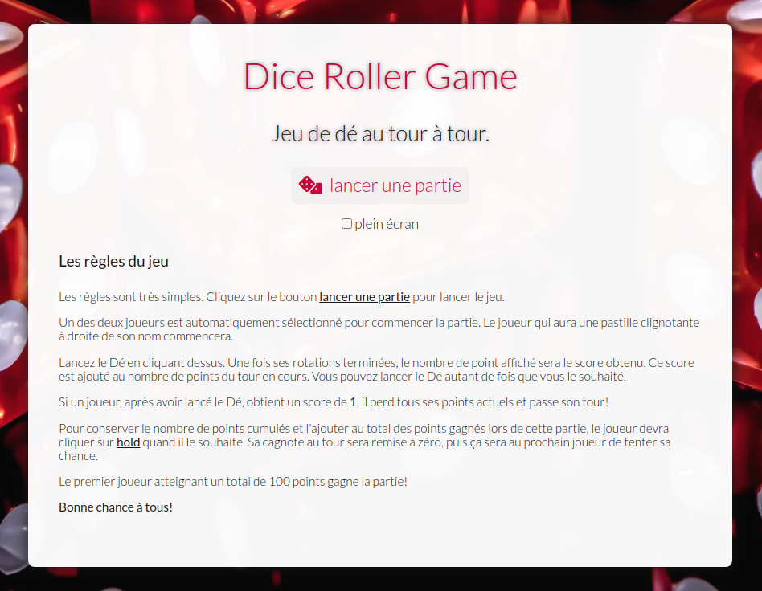
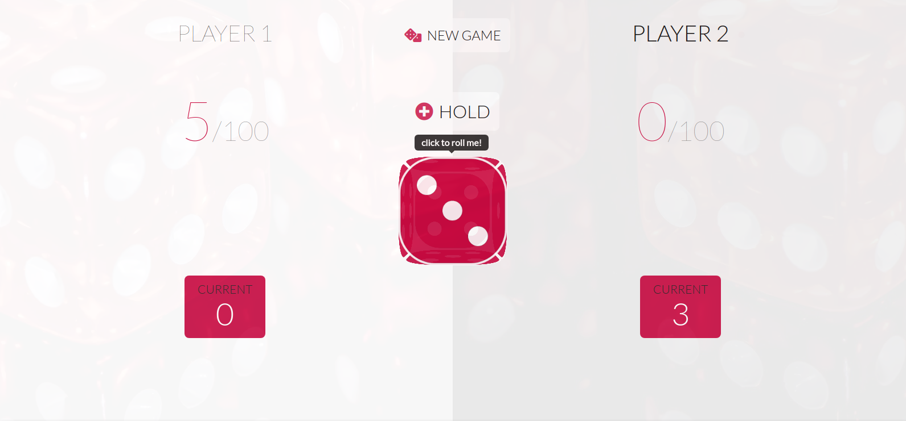
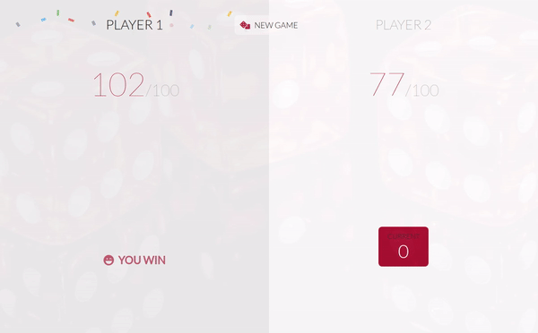

# **Studi**
## Evaluation numéro 2
<br>

<u>**Dépot Github**</u>: <a href="https://github.com/pantaflex44/studi-evals/tree/eval2" target="_blank">https://github.com/pantaflex44/studi-evals/tree/eval2</a><br>
<u>**Démonstration**</u>: <a href="https://pantaflex44.github.io/studi-evals/" target="_blank">https://pantaflex44.github.io/studi-evals/</a>

<br><br>

### Dynamiser vos sites web avec Javascript
**Compétence visée**

Dynamiser vos sites web avec Javascript
<br>

### Contenu de l'évaluation

**Consignes à respecter pour votre examen**

Cette évaluation du module Dynamiser vos sites web avec Javascript vous évalue sous la forme d'une épreuve
écrite, portant sur des situations professionnelles concrètes abordant les compétences suivantes du métier visé,
selon le référentiel de certification :
- Réaliser une interface utilisateur web statique et adaptable
- Développer une interface utilisateur web dynamique

L’examen se déroule en 1 étape de validation par le correcteur, avec le dépôt de vos livrables sur la plateforme,
de la manière suivante :
- Vous déposez votre copie sur la plateforme dans votre espace : « Évaluation d'entraînement - Dynamiser
vos sites web avec Javascript ».

À l’issue de cette correction, vous aurez une appréciation de votre formateur. Cette appréciation sera
accompagnée, à titre purement indicatif, d’une note vous permettant de vous situer dans le processus
d’acquisition des compétences décrites plus haut.

Ce livrable est à remettre avec les dossiers correspondants à chaque partie de l’énoncé.

Comme vous êtes aussi évalué sur la présentation de vos outils et synthèses, ainsi que sur la présentation finale
du livrable, vous devez l’élaborer sur un support autre que cet énoncé. Ce support sera celui de votre choix, mais
qui doit être adapté aux consignes de l’énoncé. La mise en page de cette étude de cas est libre.
Nos formateurs référents vous guident et vous accompagnent dans l’élaboration de votre livrable.
Notre équipe assurera le suivi pédagogique de votre dossier à travers l’interface exclusive
d'échange dans l’espace Evaluations.

Veuillez noter que les envois des différentes étapes qui seraient envoyés par un autre
moyen que cette interface ‘Evaluation’ de votre plateforme (courrier, email, fax) ne pourront être traités.
Seuls les documents transmis au format .doc, .docx ou au format .pdf ou .zip pourront être traités par
notre serveur.

**Livrable attendu pour l’examen de ce bloc**

Création d’un petit jeu sur navigateur web à l’aide du DOM.
En fin de prestation, le commanditaire doit recevoir les différents éléments suivants :
- Un jeu fonctionnel
- Une interface lisible qui correspond à la maquette fournie.
  
Ceci implique plusieurs fonctionnalités globales :
- En front-desk (côté client) :
  - La possibilité de créer une nouvelle partie
  - La possibilité de retenir le score courant
  - La possibilité de lancer le dé
  - La possibilité d’avoir 2 joueurs

**Contexte du projet**

<u>Règles</u> :
<br>
Le jeu comprend 2 joueurs sur un seul et même écran.
Chaque joueur possède un score temporaire (ROUND) et un score global (GLOBAL).
À chaque tour, le joueur a son ROUND initialisé à 0 et peut lancer un dé autant de fois qu'il le souhaite. Le
résultat d’un lancer est ajouté au ROUND.
Lors de son tour, le joueur peut décider à tout moment de:
- Cliquer sur l’option “Hold”, qui permet d’envoyer les points du ROUND vers le GLOBAL. Ce sera alors le
tour de l’autre joueur.
- Lancer le dé. S’il obtient un 1, son score ROUND est perdu et c’est la fin de son tour.
Le premier joueur qui atteint les 100 points sur global gagne le jeu.

**Modalités Pédagogiques**

<u>Modalités / Restrictions :</u>
1. Votre code sera structuré
2. Le jeu devra être fonctionnel
3. Les ressources seront disponibles dans un dossier images
    - La font sera Lato (google font) : https://fonts.google.com/specimen/Lato
    - Le Framework CSS de votre choix

<u>Barème et critères d’évaluation</u>
1. Connaître et utiliser un environnement de développement (2 points).
2. Écrire un algorithme et l’intégrer dans une page web avec des scripts événementiels et avec un langage de script côté client (5 points).
3. Utilisation des normes ECMAScript (JS) et du DOM (5 points).
4. Connaissance et utilisation d’un framework de présentation de type adaptatif (5 points).
5. Déploiement de la réalisation en ligne (3 points).

<hr>

### Ma proposition
*(Durée du travail: environ 40 heures)*
*(outils de développement: VSCode)*
<br><br><center>



</center><br><br>

**Description du projet et déroulement du développement**

<u>**Dépot Github**</u>: <a href="https://github.com/pantaflex44/studi-evals/tree/eval2" target="_blank">https://github.com/pantaflex44/studi-evals/tree/eval2</a><br>
<u>**Démonstration**</u>: <a href="https://pantaflex44.github.io/studi-evals/" target="_blank">https://pantaflex44.github.io/studi-evals/</a>

N'étant pas du tout spécialiste des jeux web, je commence cet exercice par rechercher des informations à ce sujet.
Au gré de mes découvertes je construis petit à petit les contours du projet.
<br>
Une fois ces contours définis, je me lance dans l'écriture des grandes lignes de la future application mobile et desktop.

Je continue le développement par la mise en place d'un fichier HTML 'index.html' qui sera le receptable web du jeu.
J'utilise les mêmes principes et procédés que ceux employés dans l'évaluation numéro 1, à savoir l'utilisation d'une structure HTML5 et l'intégration des balises mots clefs, description, titre, et sociales nécessaires au bon référencement.
<br>
<br>
Je poursuis le développement par la création du fichier javascript 'dicerollergame.js' qui contiendra les lignes de code du futur jeu. Pour ce développement, j'utiliserai au maximum l'ECMAScript6 avec notamment les nouvelles formulations:

<u>exemple</u>
```javascript
/**
 * Events manager
 */
class Events {
  /**
   * Load the events manager
   */
  constructor() {
    this.callbacks = {}
  }
  
  /**
   * Register an event
   * @param {string} name Event name
   * @param {object} callback Callback called when event fired
   */
  register(name, callback) {
    if (!this.callbacks[name]) {
      this.callbacks[name] = []
    }

    this.callbacks[name].push(callback)
  }
  
  /**
   * Fire events from his name
   * @param {string} name Event name
   */
  fire(name) {
    if (this.callbacks[name]) {
      for(let i = 0; i < this.callbacks[name].length; i++) {
        this.callbacks[name][i](...arguments)
      }
    }
  }
}
```

Les modalités de l'exercice prévoient l'utilisation de la police d'écriture 'Lato' et l'utilisation du framework CSS de notre choix.
Souhaitant limiter un maximum l'intégration de multiples éléments dans la page HTML ('index.html') pour l'intégration du jeu, je réalise ces implémentations directement en Javascript à travers une fonction et la manipulation du DOM:

- Google Font : Lato
- Framework CSS : Aucun - Mais utilisation de l'outil Normalize.css pour généraliser l'ajustement de l'interface Web quelque soit le navigateur utilisé par le joueur.

```javascript
/**
 * Load expected CSS modules
 */
initializeCss() {
    const heads = document.getElementsByTagName('head')
    if (!heads || heads.length == 0) {
      throw new Error('You must create a game instance in a valid HTML DOM document. No head tag found.')
    }

    const head = heads[0]

    const normalizeLink = document.createElement('link')
    normalizeLink.rel = 'stylesheet'
    normalizeLink.href = 'https://cdnjs.cloudflare.com/ajax/libs/normalize/8.0.1/normalize.min.css'
    head.appendChild(normalizeLink)

    const drgLink = document.createElement('link')
    drgLink.rel = 'stylesheet'
    drgLink.href = './dicerollergame.css'
    head.appendChild(drgLink)
}
```

Pour intégrer le jeu dans sa page web:

```html
<html>
    <head>
      ...
    </head>
    <body>
        <div id="diceRollerContainer">
            <input type="button" value="start" onclick="DiceRollerGame.game().start()">
        </div>

        <script type="text/javascript" src="./dicerollergame.js"></script>
        <script type="text/javascript">
            DiceRollerGame.game('diceRollerContainer')
        </script>
    </body>
</html>
```

Dice Roller Game permet d'être joué en mode plein écran et force l'utilisation du mode paysage. Pour arriver à celà j'ai réalisé ces 2 fonctions:

```javascript
/**
 * Force screen in 'Fullscreen' mode
 */
function forceFullscreen() {
  document.body.requestFullscreen()
    .then(() => {
      console.log(`Screen viewport initilized in 'fullscreen' mode.`)
    })
    .catch((error) => {
      console.log(`'Fullscreen' mode not availlable: ${error}`)
    })
}

/**
 * Force screen orientation to 'landscape' mode
 */
function forceLandscape() {
  screen.orientation.lock('landscape')
    .then(() => {
      console.log(`Screen orientation initilized in 'landscape' mode.`)
    })
    .catch((error) => {
      console.log(`'Landscape' mode not availlable: ${error}`)
    })
}
```

<br><br>
Pour compléter le nécessaire à l'utilisation de Git et Github, je crée ce fichier fichier README.md que je compléterai au fûr et à mesure du développement. Je crée par la même un fichier LICENSE.txt contenant la licence d'utilisation des sources. Ici sera employée la GNU GPL v3.

Une fois ceci fait, j'ouvre mon terminal, et tape la commande:
```bash
$ git init
```
qui me permet d'initialiser un dépot Git.

Puis je viens lier mon dépôt local à mon dépôt précédement créé et configuré sur Github:
```bash
$ git remote add origin https://github.com/pantaflex44/studi-evals.git
```

A suivre, j'ajoute les fichiers nouvellement créés à mon dépot local:
```bash
$ git add .
```

Et je réalise mon premier commit en y ajoutant le premier message:
```bash
$ git commit -m "Initialisation du dépot"
```

Je renome la branche par défaut 'master' en 'eval2':
```bash
$ git branch --move master eval2
$ git push --set-upstream origin eval2
```

Pour finir, je pousse ce premier commit sur le dépôt Github:
```bash
$ git push origin eval2
```

Tout au long du développement, je continuerai à pousser les changements sur le dépot Github en utilisant les 3 dernières commandes citées ci-dessus et résumées comme suit:
```bash
$ git add -A
$ git commit -m "Rapport des modifications"
$ git push
```

La base est prète pour commencer le travail.

<br><center>





</center><br>

### Informations complémentaires

**Code source**

Pour cloner le dépot Github des différentes évaluations et suivre son évolution:
```bash
$ git clone https://github.com/pantaflex44/studi-evals.git studi_evals
$ cd studi_evals
```

**Photos et illustrations**

- Toutes les photos d'illustrations proviennent d'Internet.
- Les icones proviennent du site https://fontawesome.com/.

<!--### Correction du formateur Studi le EN ATTENTE

**Dossier et Correction**

EN ATTENTE

**Notes**

EN ATTENTE

**Message du correcteur**

EN ATTENTE-->
<br>
<br>

<u>**Dépot Github**</u>: <a href="https://github.com/pantaflex44/studi-evals/tree/eval2" target="_blank">https://github.com/pantaflex44/studi-evals/tree/eval2</a><br>
<u>**Démonstration**</u>: <a href="https://pantaflex44.github.io/studi-evals/" target="_blank">https://pantaflex44.github.io/studi-evals/</a>